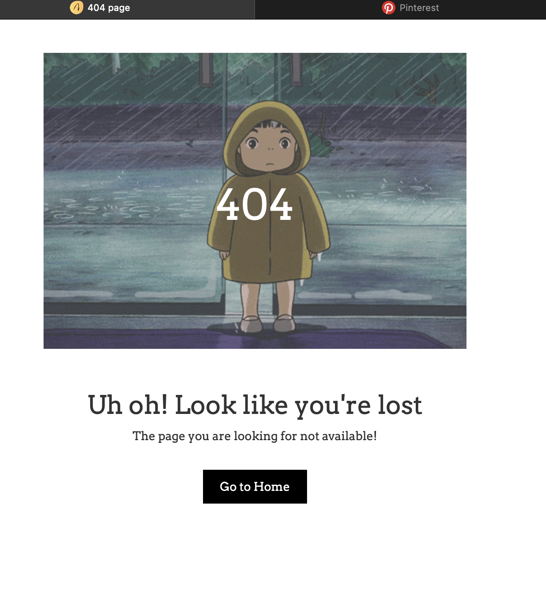
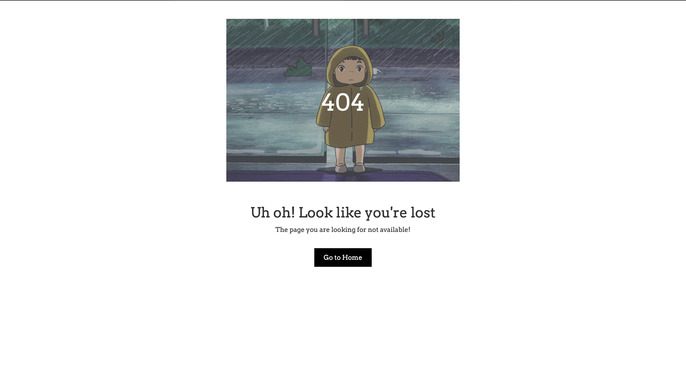

# 404-page


A custom **404 error page** built using **HTML, CSS, and Bootstrap**.  
It displays an animated GIF background with a clean design to let users know when a page is not found.


## 🚀 Features
- Custom animated background (`.gif` support).
- Responsive layout using Bootstrap.
- Simple and minimal design with central alignment.
- Easy to integrate into any project.

---

## 📂 Project Structure
.
├── index.html   # Main 404 page
├── style.css    # Custom styling
├── Bit blowy out.gif # Background GIF


---

## 🖼️ Preview
Screenshot ---




The page shows:
- Large **404 text** in the center.
- A short error message.
- A button to redirect users back to the homepage.

---

## ⚡ Usage
1. Clone the repository:
   ```bash
   git clone https://github.com/SaniaDebbarma/404-page.git

  2.	Open index.html in your browser to see the 404 page.
	3.	Update the link inside:
<a href="/" class="link_404">Go to Home</a>

to redirect users to your homepage.

⸻

🎨 Customization
	•	Replace Bit blowy out.gif with your own animated GIF or background image.
	•	Edit style.css to tweak colors, fonts, or layout.
	•	Change error text/messages inside index.html.

⸻

📜 License

This project is open-source and available under the MIT License.
